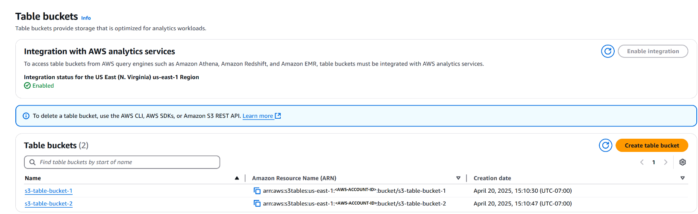
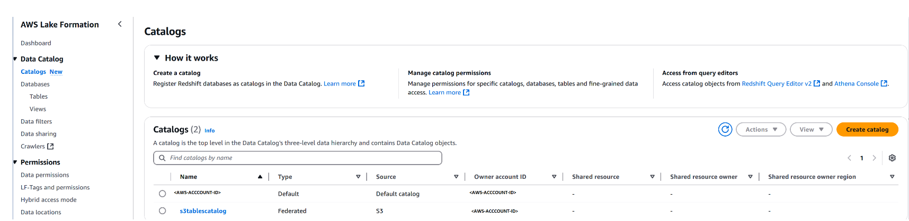
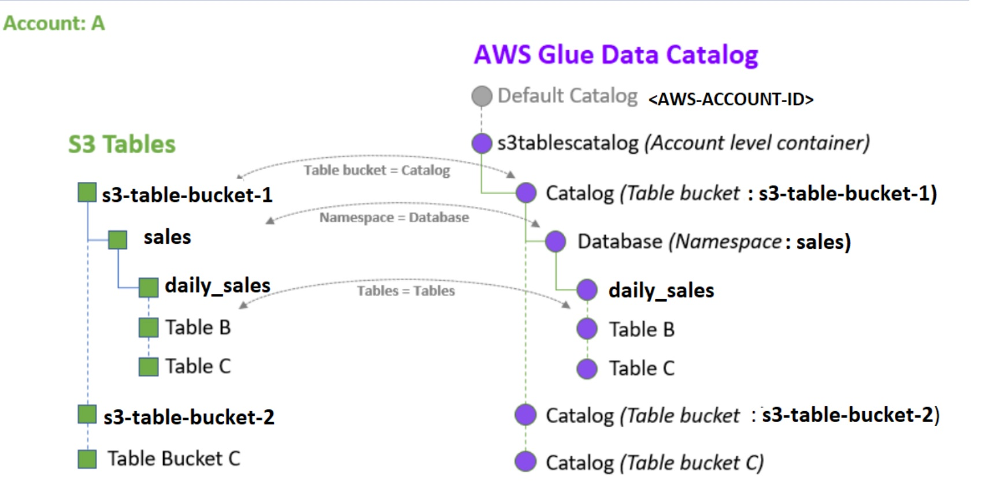
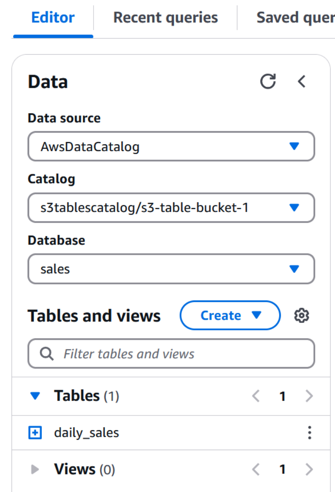

## Exploring AWS S3 Tables: Federated Catalogs, Lake Formation Integration, and Access Challenges

This week, i got chance to get hands-on on the new AWS S3 Tables. Following are my observations and learnings.

Here is a brife note on [Amazon S3 Tables](https://aws.amazon.com/blogs/aws/new-amazon-s3-tables-storage-optimized-for-analytics-workloads/): Amazon S3 Table give you storage that is optimized for tabular data such as daily purchase transactions, streaming sensor data, and ad impressions in Apache Iceberg format, for easy queries using popular query engines like Amazon Athena, Amazon EMR, and Apache Spark. When compared to self-managed table storage, you can expect up to 3x faster query performance and up to 10x more transactions per second, along with the operational efficiency that is part-and-parcel when you use a fully managed service


### Key AWS Changes to supports  S3-Tables

#### Changes in Amazon S3

* New **Table Buckets** in the left side Navigation below **General Purpose Buckets** and **Directory Buckets**.
* Each S3 Table Bucket provides options to create multiple namespaces and multiple tables within each namespace.
* Note : Not all S3-Table buckets operations are supported through AWS Console. some are supported through CLI and REST API , like deleting bucket, managing resource policies




#### Changes in Lakeformation


  
  
- Added new section for **Catalogs** 

- **Default Catalog** – Named `<AWSAccountID>` in Lake Formation.
- **S3 Tables Catalog** – Named `<AWSAccountID>:S3TablesCatalog/<S3TableBucketName>`  in Lake Formation.

#### Mapping of S3-Table resources to Lakeformation Catalog

  

  
  
- Each **S3 Table Bucket** is now treated as a **separate Glue Catalog**, referred to as a *Federated Catalog* in **Lake Formation**.
- You can create multiple **namespaces** (database equivalents) within a single S3 Table Bucket.
- Each table is tied to a namespace.
- Each S3-Bucket based table has Location which looks like `s3://<table-id>--table-s3` (this isn’t listed as regular bucket via `aws s3 ls`)
- 
#### Glue Catalog  : No changes.
- Glue Console doesn’t currently show these federated S3TableCatalog entries. They appear only in **Lake Formation**

#### Analytical Services Integration

First time, we create S3 Table Bucket, we get an option to chose "Enable Integration". When you enable integration with analytics services, AWS creates a federated catalog (`s3tablescatalog`)  and IAM role `S3TablesRoleForLakeFormation`

#### Athena 

As shown in the below image, the S3-Tables are shown under Separate Catalogs, Databases (Namespace).



### Observations and Challenges

- **S3-Tables** aren’t visible in Glue Catalog, only in Lake Formation.
- **S3-Tables** are queryable using SQL via Athena and other services . More on [s3-tables-access](https://docs.aws.amazon.com/AmazonS3/latest/userguide/s3-tables-access.html)
- **S3-Tables** are not directly importable into QuickSight using the default data source.
  - Workaround: Use **custom SQL** like:

    ```sql
    SELECT * FROM "S3TablesCatalog/<S3TabeBucketName>.<NamespaceName>.<TableName>"
    ```

- The S3 Buckets shown under **Location** property of **S3-Tables** in Lakefomration is niether listed in the S3 Regular Buckets or not listable via CLI (`aws s3 ls`).


### Open Questions

* Which account has S3 Buckets shown under **Location** property of **S3-Tables** in Lakefomration? how to get access to the S3 bucket for checking the metadata and the actual data ? 


