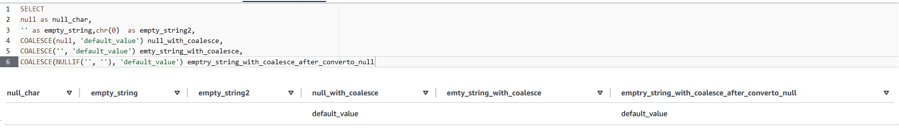

# Empty String vs NULL: A Common Confusion for Data Engineers and Analysts

## Introduction ##

One of the sources of confusion for data engineers is the distinction between empty strings ('') and NULL values. Dont belive me? Look at the following screenshot showing the NULL and Emptry Strings in the output. Visually both looks similar .
 



While both may seem similar at first glance, they have fundamental differences that can impact data quality, query results, and application logic.Misunderstanding these concepts often leads to more time spent in debugging data quality issues.In this blog, we’ll clarify the difference between empty strings and NULL values, explore common pitfalls, and provide practical tips to handle them effectively in SQL-based databases like Amazon Redshift, AWS Athena, and others.

## Understanding the Difference

### NULL: The Absence of a Value

- Represents **unknown or missing data**.
- Special SQL keyword, **not a string or a number**.
- Comparisons (`=` or `!=`) do **not** work with `NULL`; use `IS NULL` or `IS NOT NULL` instead.
- Functions like `COALESCE()` replace `NULL` values.

### Empty String (`''`): A Valid String With No Characters

- Represents **a known but empty** value.
- It is **not** NULL and can be compared with `=` or `!=`.
- Functions like `LENGTH('')` return `0`, while `LENGTH(NULL)` returns `NULL`.

---

## Common Pitfalls and Unexpected Behaviors

### 1. **COALESCE Doesn’t Replace Empty Strings**

```sql
SELECT COALESCE('', 'default_value');
```

**Output:** `''` (empty string, not `default_value`)

✅ **Fix:** Use `NULLIF` to treat empty strings as `NULL`:

```sql
SELECT COALESCE(NULLIF('', ''), 'default_value');
```

**Output:** `default_value`

---

### 2. **Incorrect Joins Due to Empty Strings vs NULL**

```sql
SELECT * FROM users u
JOIN orders o ON u.email = o.email;
```

- If `orders.email` contains empty strings while `users.email` has NULLs, the join **fails** to match missing data.
- **Solution:** Normalize missing values before joining:

```sql
SELECT * FROM users u
JOIN orders o ON NULLIF(u.email, '') = NULLIF(o.email, '');
```

---

### 3. **Aggregations Behave Differently**

- **COUNT(column_name)** **excludes** `NULL` values but includes empty strings.
- **COUNT(*)** counts all rows, including those with NULLs.
- **AVG(column_name)** ignores NULLs but includes empty numeric fields as `0` if stored as `VARCHAR`.

✅ **Fix:** Use `NULLIF` before aggregation to exclude empty strings:

```sql
SELECT COUNT(NULLIF(email, '')) FROM users;
```

---

## Migration Challenges: Oracle to Redshift

If you're migrating from **Oracle to Amazon Redshift**, you may face unexpected issues due to differences in how they handle empty strings and NULL values:

- In **Oracle**, `''` (empty string) is automatically converted to `NULL`.
- In **Redshift**, `''` remains an empty string and is **not treated as `NULL`**.

### Example Issue:

```sql
-- Oracle behavior ('' is treated as NULL)
SELECT COALESCE('', 'default_value') FROM dual;
-- Output: 'default_value'

-- Redshift behavior ('' remains an empty string)
SELECT COALESCE('', 'default_value');
-- Output: '' (empty string, not replaced)
```

### How to Handle This in Redshift:

✅ Use `NULLIF` to explicitly convert empty strings to `NULL` before applying `COALESCE`:

```sql
SELECT COALESCE(NULLIF(column_name, ''), 'default_value') FROM table_name;
```

✅ Standardize data during migration by ensuring missing values are explicitly `NULL`.

✅ Review application logic that assumes `''` and `NULL` are interchangeable.

---

## Programming Context: NULL vs Empty Strings in C

[Note: Following example is taken from https://c-for-dummies.com/blog/?p=2641

The C language provides a unique perspective on empty strings vs. NULL values that data engineers should be aware of. Unlike SQL databases, where NULL represents missing data, in C:

- A **null string** is an uninitialized character array, meaning it exists in memory but has no assigned value.
- An **empty string** contains the `\0` null character, meaning it is explicitly set to a zero-length string.

### Example in C:

```c
#include <stdio.h>
#include <string.h>

int main() {
    char empty[5] = { '\0' };
    char null[5];

    if (strcmp(empty, null) == 0)
        puts("Strings are the same");
    else
        puts("Strings are not the same");

    return 0;
}
```

**Output:**
```
Strings are not the same
```

- `empty[]` is an **empty string** with a null terminator (`\0`).
- `null[]` is an **uninitialized array**, which may contain garbage values.
- `strcmp()` correctly differentiates between them.

This behavior highlights the importance of **initialization** and **explicit null handling**, which also applies when dealing with NULL and empty strings in databases.

---

## Best Practices to Handle NULL and Empty Strings

✅ **Define NULL Handling at Data Ingestion:** Standardize whether missing values should be `NULL` or empty strings or defaulted to a fixed value.

✅ **Use `NULLIF(column, '')` to convert empty strings to NULL where needed.**

✅ **Check for `NULL` explicitly using `IS NULL` or `IS NOT NULL`.**

✅ **Check for `EMPTY STRING ('') ` explicitly using `IS ''`

✅ **Normalize missing data before joins and aggregations.**


---

## Conclusion

Both NULL and empty strings can lead to subtle yet serious data inconsistencies. Understanding their behavior helps data engineers and analysts avoid common mistakes and write cleaner, more reliable SQL queries. By applying these best practices, you can ensure accurate reporting, smoother data transformations, and better overall data quality.

Do you have your own tips or experiences dealing with NULLs and empty strings? Share them in the comments!


